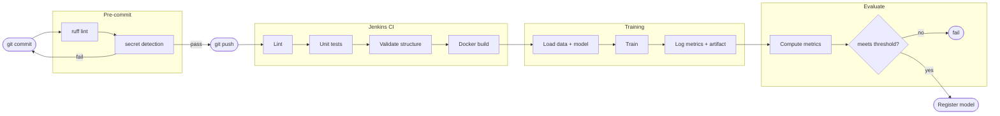

```mermaid
flowchart LR
    A([git commit]) --> B

    subgraph PRE["Pre-commit"]
        B[ruff lint] --> C[secret detection]
    end

    C -->|fail| A
    C -->|pass| D([git push])

    D --> E

    subgraph CI["Jenkins CI"]
        E[Lint] --> F[Unit tests]
        F --> G[Validate structure]
        G --> H[Docker build]
    end

    H --> I

    subgraph TRAIN["Training"]
        I[Load data + model] --> J[Train]
        J --> K[Log metrics + artifact]
    end

    K --> L

    subgraph EVAL["Evaluate"]
        L[Compute metrics]
        L --> M{meets threshold?}
        M -->|no| N([fail])
    end

    M -->|yes| O([Register model])
```
